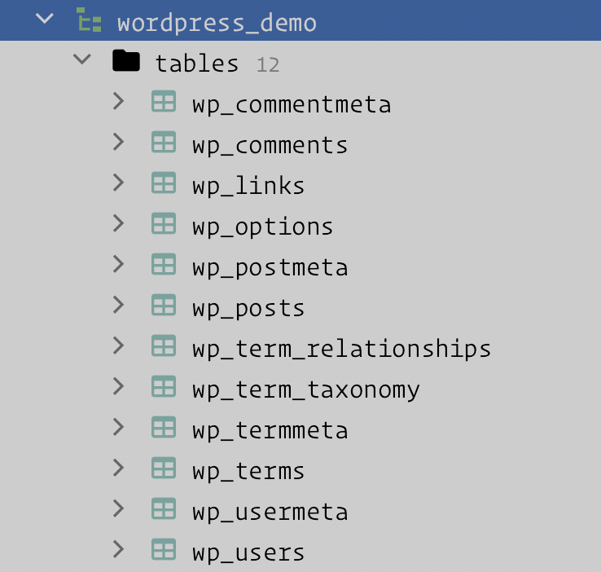

# 数据库表结构

WordPress 的功能强大，而且可以轻松实现各种扩展，包括自定义主题和插件，这些都得益于它表的设计，为了更好的了解 WordPress，应该先了解 WordPress 默认的表的作用，以及每张表之间的关系。

WordPress 6.0.1 在安装完成后会创建默认的数据库，具体的表如下：

## 默认数据表结构

- `wp_comments` 文章评论信息表
    ::: details `wp_comments` 表字段
    - `comment_ID`：自增唯一ID
    - `comment_post_ID`：对应文章ID
    - `comment_author`：评论者
    - `comment_author_email`：评论者邮箱
    - `comment_author_url`：评论者网址
    - `comment_author_IP`：评论者IP
    - `comment_date`：评论时间
    - `comment_date_gmt`：评论时间（GMT+0时间）
    - `comment_content`：评论正文
    - `comment_karma`：未知
    - `comment_approved`：评论是否被批准
    - `comment_agent`：评论者的USER AGENT
    - `comment_type`：评论类型
    - `comment_parent`：父评论ID
    - `user_id`：评论者用户ID（不一定存在）
    :::

- `wp_commentmeta` 文章评论额外信息表
    ::: details `wp_commentmeta` 表字段
    - `meta_id`：自增唯一ID
    - `comment_id`：对应评论ID
    - `meta_key`：键名
    - `meta_value`：键对应的值
    :::

- `wp_links` 链接信息表
    ::: details `wp_links` 表字段
    - `link_id`：自增唯一ID
    - `link_url`：链接URL
    - `link_name`：链接标题
    - `link_image`：链接图片
    - `link_target`：链接打开方式
    - `link_description`：链接描述
    - `link_visible`：是否可见（Y/N）
    - `link_owner`：添加者用户ID
    - `link_rating`：评分等级
    - `link_updated`：未知
    - `link_rel`：XFN关系
    - `link_notes`：XFN注释
    - `link_rss`：链接RSS地址
    :::

- `wp_options` 基本配置信息表
    ::: details `wp_options` 表字段
    - `option_id`：自增唯一ID
    - `blog_id`：博客ID，用于多用户博客，默认0
    - `option_name`：键名
    - `option_value`：键值
    - `autoload`：在WordPress载入时自动载入（yes/no）
    :::

    ::: tip 一般用法
    通常通过 `get_option()` 函数来操作，该表通常作为插件存储数据的表
    :::

- `wp_posts` 文章信息表，包括了日志、附件、页面等等信息。是 `WordPress` 最重要的一个数据表
    ::: details `wp_posts` 表字段
    - `ID`：自增唯一ID
    - `post_author`：对应作者ID
    - `post_date`：发布时间
    - `post_date_gmt`：发布时间（GMT+0时间）
    - `post_content`：正文
    - `post_title`：标题
    - `post_excerpt`：摘录
    - `post_status`：文章状态（publish/auto-draft/inherit等）
    - `comment_status`：评论状态（open/closed）
    - `ping_status`：PING状态（open/closed）
    - `post_password`：文章密码
    - `post_name`：文章缩略名
    - `to_ping`：未知
    - `pinged`：已经PING过的链接
    - `post_modified`：修改时间
    - `post_modified_gmt`：修改时间（GMT+0时间）
    - `post_content_filtered`：未知
    - `post_parent`：父文章，主要用于PAGE
    - `guid`：未知
    - `menu_order`：排序ID
    - `post_type`：文章类型（post/page等）
    - `post_mime_type`：MIME类型
    - `comment_count`：评论总数
    :::

- `wp_postmeta` 文章额外数据表，例如文章浏览次数，文章的自定义字段等都存储在这里
  ::: details `wp_postmeta` 表字段
  - `meta_id`：自增唯一ID
  - `post_id`：对应文章ID
  - `meta_key`：键名
  - `meta_value`：键值
  :::

- `wp_terms` 文章分类、链接分类、标签的信息表
  ::: details `wp_terms` 表字段
  - `term_id`：分类ID
  - `name`：分类名
  - `slug`：缩略名
  - `term_group`：未知
  :::

- `wp_termmeta` 存储对菜单分类的更多设置，属于开发性功能居多，例如分类目录的缩略图、颜色标识等
  ::: details `wp_temmeta` 表字段
  - `meta_id`：自增唯一ID
  - `term_id`：对应分类ID
  - `meta_key`: 键名
  - `meta_value`: 键对应的值
  :::

- `wp_term_relationships` 分类与文章信息表 `wp_posts` 、链接表 `wp_links` 的关联表。
  ::: details `wp_term_relationships` 表字段
  - `object_id`：对应文章ID/链接ID
  - `term_taxonomy_id`：对应分类方法ID
  - `term_order`：排序
  :::

- `wp_term_taxonomy` 分类信息表，区分 `wp_terms` 信息的分类类型，有 `category`、`link_category` 和 `tag` 三种分类类型
  ::: details `wp_term_taxonomy` 表字段
  - `term_taxonomy_id`：分类方法ID
  - `term_id`：taxonomy`：分类方法(category/post_tag)
  - `description`：未知
  - `parent`：所属父分类方法ID
  - `count`：文章数统计
  :::

- `wp_users` 用户基本信息表，存放系统所有用户基本信息
  ::: details `wp_users` 表字段
  - `ID`：自增唯一ID
  - `user_login`：登录名
  - `user_pass`：密码
  - `user_nicename`：昵称
  - `user_email`：Email
  - `user_url`：网址
  - `user_registered`：注册时间
  - `user_activation_key`：激活码
  - `user_status`：用户状态
  - `display_name`：显示名称
  :::

- `wp_usermeta` 用户额外信息表
  ::: details `wp_usermeta` 表字段
  - `meta_id`：自增唯一ID
  - `user_id`：对应用户ID
  - `meta_key`：键名
  - `meta_value`：键值
  :::

其中可以根据功能还将上面的表分类为以下 6 大类：

- 文章评论信息 `wp_comments`、`wp_commentmeta`
- 链接信息 `wp_links`
- 基本配置信息 `wp_options`
- 文章信息 `wp_posts`、`wp_postmeta`
- 分类信息 `wp_terms`、`wp_termmeta`、`wp_term_relationships`、`wp_term_taxonomy`
- 用户信息 `wp_users`、`wp_usermeta`

## 数据表关联关系

| 类型     | 涉及数据表                                                                                                                                | 关联关系                                                                                                                                                                                                                                                                                                                                                                                                                         |
|--------|--------------------------------------------------------------------------------------------------------------------------------------|------------------------------------------------------------------------------------------------------------------------------------------------------------------------------------------------------------------------------------------------------------------------------------------------------------------------------------------------------------------------------------------------------------------------------|
| 文章评论信息 | `wp_comments`、`wp_posts`、`wp_users`、`wp_usermeta`                                                                                    | 1. 确定文章评论 `wp_posts.ID` -> `wp_comments.comment_post_id`   2. 确定文章评论的作者 `wp_comments.comment_author` -> `wp_users.ID` 和 `wp_users.ID` -> `wp_usermeta.user_id`                                                                                                                                                                                                                                                     |
| 链接信息   | `wp_links`、`wp_term_relationships`、`wp_terms`、`wp_termmeta`、`wp_term_taxonomy`、 `wp_users`、`wp_usermeta`                             | 1. 确定链接所属分类 `wp_links.link_id` -> `wp_term_relationships.object_id`  2. `wp_term_relationships.term_taxonomy_id` -> `wp_term_taxonomy.term_taxonomy_id`（该关系还要取决与 `wp_term_taxonomy` 表中的 `taxonomy` 分类类型为 `link_category`） 3. `wp_terms.term_id` -> `wp_term_taxonom.term_id`                                                                                                                                       | 
| 基本配置信息 | `wp_options`                                                                                                                         | 没有关联关系                                                                                                                                                                                                                                                                                                                                                                                                                       |
| 文章信息   | `wp_posts`、`wp_postmeta`、`wp_comments`、`wp_term_relationships`、`wp_terms`、`wp_termmeta`、` wp_term_taxonomy`、`wp_users`、`wp_usermeta` | 1. 确定文章信息 `wp_posts.ID` -> `wp_postsmeta.post_id`   2. 确定文章所属分类 `wp_posts.ID` -> `wp_term_relationships.object_id` 和 `wp_term_relationships.term_taxonomy_id` -> `wp_term_taxonomy.term_taxonomy_id`（该关系还要取决与 `wp_term_taxonomy` 表中的 `taxonomy` 分类类型为 `category` 或者 `tag`）和 `wp_terms->term_id` -> `wp_term_taxonomy.term_id`  3. 确定文章作者 `wp_posts.author` -> `wp_users.ID`和`wp_users.ID` -> `wp_usermeta.user_id` |
| 分类信息   | `wp_terms`、`wp_term_taxonomy`                                                                                                        | `wp_terms.term_id` -> `wp_term_taxonomy.term_id`                                                                                                                                                                                                                                                                                                                                                                             |
| 用户信息   | 数据表：`wp_users`、`wp_usermeta`                                                                                                         | `wp_users.ID` -> `wp_usermeta.user_id`                                                                                                                                                                                                                                                                                                                                                                                       |
::: tip 开启链接管理
在 WordPress 3.5 之后的 WordPress 版本中，链接管理器将默认情况下将禁用。

可以使用 [Link Manager](https://cn.wordpress.org/plugins/link-manager/) 插件来确保它始终存在，即使更新到 WordPress 的更高版本或删除所有当前链接。
:::
